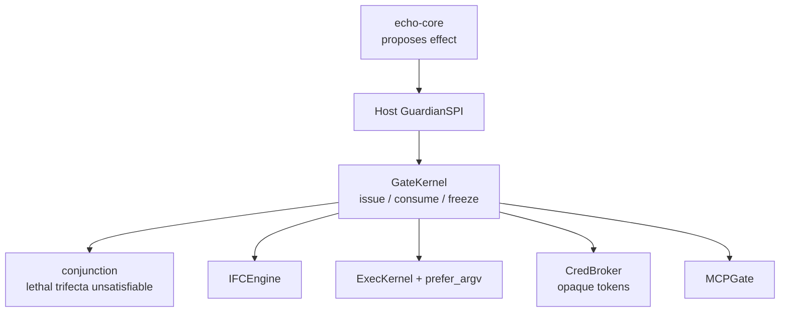

# Orin 2.0

Orin 2.0 is the **extracted security authority**: `orin-guard`, plus
`orin-proto` (wire frames, no secrets). Echo proposes; Orin stamps.

Implementation: `packages/orin-guard` and `packages/orin-proto` in
[titan-agent](https://github.com/JiangSkirk/titan-agent). Versions **2.0.0**.
PyPI is not published. This GitHub tree may still contain a host-era
`js/orin` snapshot; the extracted kernel is the workspace package.

## Kernel pieces

| Piece | Role |
|-------|------|
| `GateKernel` | HMAC tickets; single-use; `consume` checks **stored** `expires_at` |
| `PolicyPlane` | Owner-written grants; observation cannot become policy |
| Conjunction | `private.read ∩ web.read ∩ egress.send` is unsatisfiable |
| `ExecKernel` | Tainted privileged sinks fail closed; argv preferred over shell strings |
| `IFCEngine` | SECRET cannot egress |
| `CredBroker` | Sandbox holds opaque tokens, never raw keys |
| `MCPGate` | Pin MCP descriptors; no `--force` |

`echo-core` never imports `orin-guard`. The Host adapter stamps tickets.

## Defaults (do not over-claim)

- Product `orin.enabled` / `orin.enforce` default **false**
- Stage C cells / process split: **`not_implemented`**
- Lethal trifecta is a kernel invariant even when enforce is off in the Host
- No TCC / FTO / independent red team
- Not a hyphen-free GitHub `v*` stable tag
